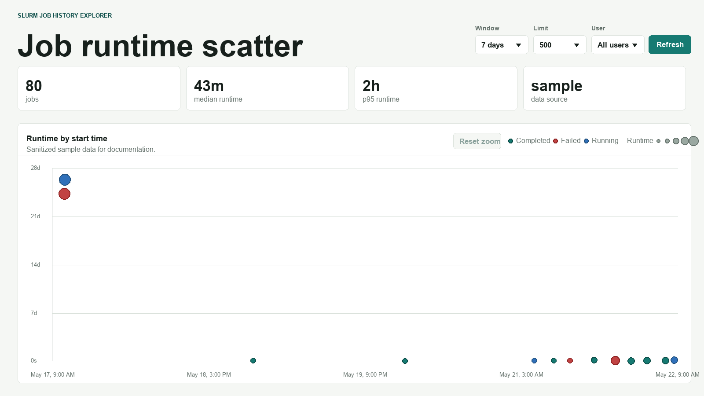
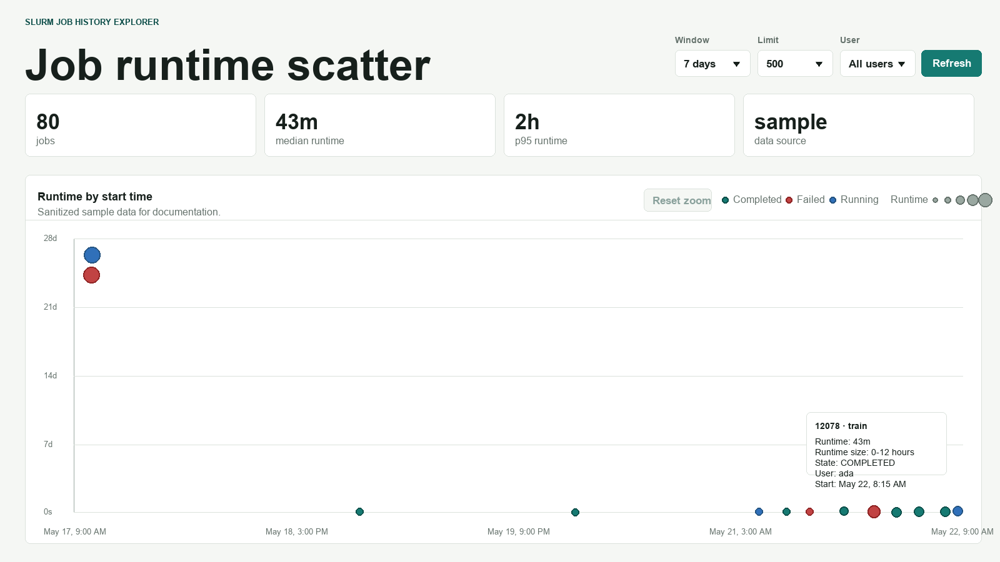

# Usage

## Sample Screenshots

The images below use sanitized sample data for documentation.

## Filters

- `Window`: reloads data for the selected number of days.
- `Limit`: caps the number of jobs returned by the API.
- `User`: filters the currently loaded data to one user. The dropdown is populated from the returned `sacct` rows.
- `Refresh`: reloads data using the current window and limit.

Changing the `Window` dropdown reloads data immediately.

## Chart

Each point is a Slurm job allocation.

- X-axis: job start time
- Y-axis: elapsed runtime
- Color: job state
- Size: runtime bucket

Hover a point to see:

- Job ID
- Job name
- Runtime
- Runtime size bucket
- State
- User
- Start time

## Mousewheel Zoom

Use the mousewheel over the chart to scale the visible time range:

- Wheel up: zoom in around the cursor
- Wheel down: zoom out around the cursor
- `Reset zoom`: return to the full loaded time range
