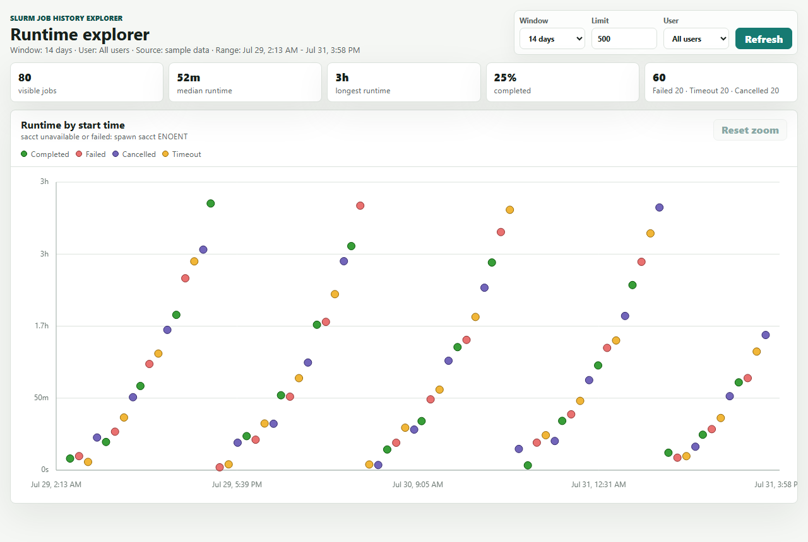
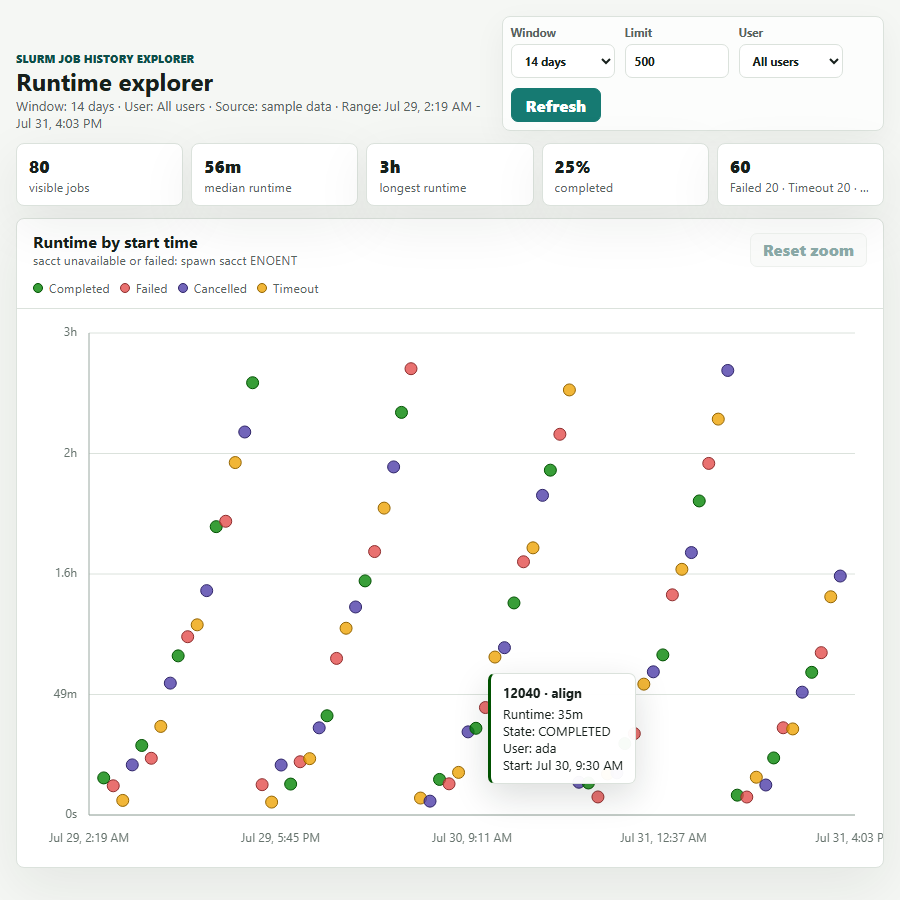

# Usage

## Sample Screenshots

The images below use sanitized sample data for documentation.

## Filters

- `Window`: reloads data for the selected number of days.
- `Limit`: caps the number of jobs returned by the API.
- `User`: reloads data scoped to one Slurm user (`limit` applies to that user's jobs). The dropdown is populated from the most recent unfiltered load.
- `Refresh`: reloads data using the current window and limit.

Changing the `Window` dropdown reloads data immediately.

## Chart

Each point is a Slurm job allocation.

- X-axis: job start time
- Y-axis: elapsed runtime
- Color: job state

Hover a point to see:

- Job ID
- Job name
- Runtime
- State
- User
- Start time

## Zooming

Scale the visible time range with the mousewheel, or a two-finger pinch on a touchscreen:

- Wheel up / pinch out: zoom in around the cursor (or pinch midpoint)
- Wheel down / pinch in: zoom out
- `Reset zoom`: return to the full loaded time range

## Accessibility

The chart is a canvas element, so its data isn't directly readable by a keyboard or screen reader. A visually-hidden table with the same job data (ID, name, user, state, start, runtime) sits alongside it in the DOM at all times — it reflects the current filters but not the chart's zoom state, since zoom only changes what's visually plotted, not what data is loaded.
